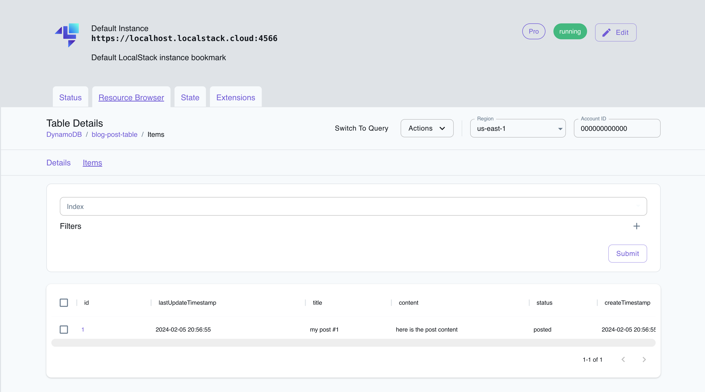

# Golang webservice with Elastic Container Service, Application Load Balancer, and DynamoDB

## Introduction

This Golang app creates a basic web service for adding and retrieving posts. It's leverages Elastic Container Service (ECS) and Application Load Balancer (ALB) for containerized app deployment and scaling. DynamoDB is used to store posts. The app is deployable on LocalStack and AWS seamlessly using Cloud Development Kit (CDK). To test, we'll show how to use LocalStack to deploy infrastructure on your developer machine and CI environment.

## Architecture

The following diagram shows the architecture that this sample application builds and deploys:

![]

We are using the following AWS services and their features to build our infrastructure:

- [ECS](https://docs.localstack.cloud/user-guide/aws/elastic-container-service/) as a container orchestration service to deploy and manage containers using Fargate.
- [DynamoDB](https://docs.localstack.cloud/user-guide/aws/dynamodb/) as a key-value NoSQL database to store and retrieve posts.
- [Elastic Load Balancing](https://docs.localstack.cloud/user-guide/aws/elastic-load-balancing/) to distribute incoming traffic across multiple targets on ECS.

## Prerequisites

- LocalStack Pro with the [`localstack` CLI](https://docs.localstack.cloud/getting-started/installation/#localstack-cli).
- [Cloud Development Kit (CDK)](https://docs.aws.amazon.com/cdk/latest/guide/getting_started.html) installed with the [`cdklocal` wrapper](https://docs.localstack.cloud/user-guide/integrations/aws-cdk/).
- [Node.js](https://nodejs.org/en/) with the `yarn` package manager.
- `curl` or a similar tool to test the application.

Start LocalStack Pro with the `LOCALSTACK_API_KEY` pre-configured:

```shell
export LOCALSTACK_API_KEY=<your-api-key>
localstack start
```

> If you prefer running LocalStack in detached mode, you can add the `-d` flag to the `localstack start` command, and use Docker Desktop to view the logs.

## Instructions

### Install the dependencies

Install the Node.js dependencies by running the following command in the `cdk` directory:

```shell
yarn install
```

### Deploy the application

To create the AWS infrastructure locally, you can use CDK and our `cdklocal` wrapper.

```shell
cdklocal bootstrap
cdklocal deploy --all
```

This will deploy the `ddblocal-fargate-stack` stack, which includes the ECS service, the Application Load Balancer, and the DynamoDB table. You will see the output of the stack, including the URL of the load balancer.

```shell
✅  ddblocal-fargate-stack

✨  Deployment time: 30.16s

Outputs:
ddblocal-fargate-stack.MyFargateServiceLoadBalancerDNS704F6391 = lb-9f06ca8a.elb.localhost.localstack.cloud
ddblocal-fargate-stack.MyFargateServiceServiceURL4CF8398A = http://lb-9f06ca8a.elb.localhost.localstack.cloud
Stack ARN:
arn:aws:cloudformation:us-east-1:000000000000:stack/ddblocal-fargate-stack/483afbca

✨  Total time: 32.92s
```

Copy the `MyFargateServiceServiceURL` output and use it to test the application.

### Testing the application

Run the following command to add a post to the database:

```bash
curl -X POST https://lb-bee07cad.elb.localhost.localstack.cloud/post \
     -H "Content-Type: application/json" \
     -d '{
        "id": "1",
        "title": "my post #1",
        "content": "here is the post content",
        "status": "posted"
     }'
```

Replace `lb-bee07cad.elb.localhost.localstack.cloud` with the URL of your load balancer. Run the following command to retrieve the post from the database:

```bash
curl -X GET https://lb-bee07cad.elb.localhost.localstack.cloud/post/1
```

You can additionally navigate to the [LocalStack Web Application](https://app.localstack.cloud) and the [DynamoDB Resource Browser](https://app.localstack.cloud/inst/default/resources/dynamodb).

Click on the **blog-post-table*** table to view the items. You can view the items by switching to scan, selecting the index, and clicking **Submit**. You will see the following:



### Run the unit tests

You can run DynamoDB unit tests for the application which creates a table, adds a post, and retrieves the post. Install the Go dependencies by running the following command in the root directory:

```bash
go get -t dynamodb-local-test/pkg/service
```

Run the tests by running the following command:

```bash
docker-compose up --detach
pushd pkg/service && go test
popd
docker-compose down
```

### GitHub Action

This application sample hosts an example GitHub Action workflow that starts up LocalStack, builds the Lambda functions, and deploys the infrastructure on the runner. You can find the workflow in the `.github/workflows/main.yml` file. To run the workflow, you can fork this repository and push a commit to the `main` branch.

Users can adapt this example workflow to run in their own CI environment. LocalStack supports various CI environments, including GitHub Actions, CircleCI, Jenkins, Travis CI, and more. You can find more information about the CI integration in the [LocalStack documentation](https://docs.localstack.cloud/user-guide/ci/).

## Contributing

We appreciate your interest in contributing to our project and are always looking for new ways to improve the developer experience. We welcome feedback, bug reports, and even feature ideas from the community. Refer to the [contributing guide](CONTRIBUTING.md) for more details on how to get started.
